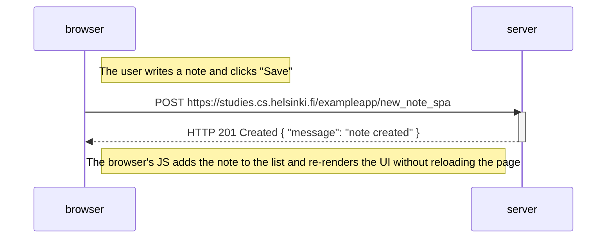

```mermaid
sequenceDiagram
    participant browser
    participant server

    Note right of browser: The user writes a note and clicks "Save"

    browser->>server: POST https://studies.cs.helsinki.fi/exampleapp/new_note_spa
    activate server
    server-->>browser: HTTP 201 Created { "message": "note created" }
    deactivate server

    Note right of browser: The browser's JS adds the note to the list and re-renders the UI without reloading the page
```